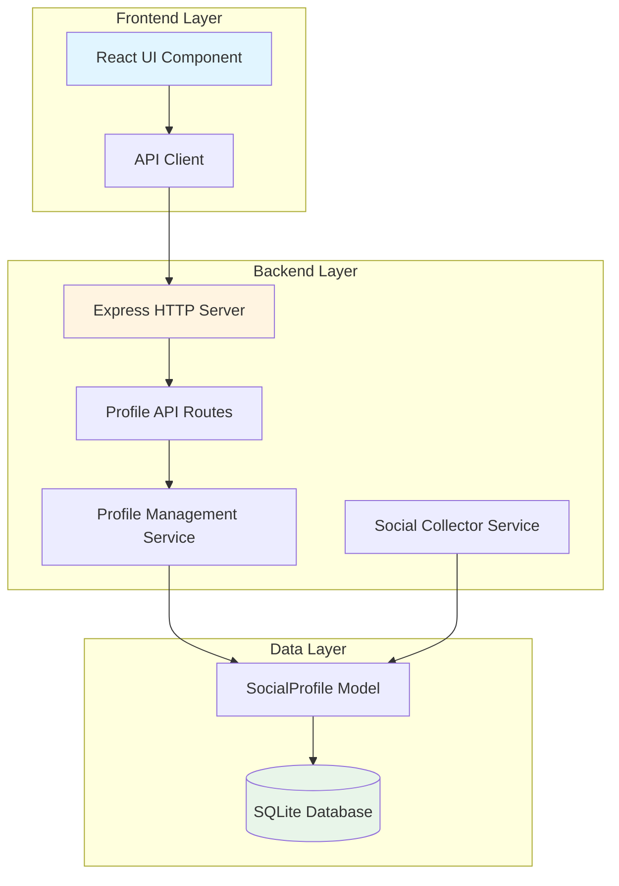

# Design Document: Social Profile GUI Management

## Overview

This feature replaces manual .env file editing with a web-based GUI for managing social trading profiles. Currently, social profiles are configured via `ROBOT_SOCIAL_PROFILE_URLS` in the .env file using a pipe-delimited format (`uid|url|displayName|confidence|activity|description`). The robot syncs these profiles to the database on startup via `syncProfiles()`, and changes require a full docker-compose restart.

The new system will provide a complete CRUD interface through the existing web dashboard, allowing users to add, edit, enable/disable, and delete profiles without touching .env files or restarting the robot. The SocialCollectorService will be modified to read active profiles directly from the database instead of filtering against .env configuration.

## Architecture

The system follows a three-tier architecture with clear separation between presentation, business logic, and data layers:



### Key Architectural Decisions

1. **Database as Single Source of Truth**: Remove .env dependency entirely. The database becomes the authoritative source for profile configuration.

2. **Status Field for Enable/Disable**: Leverage the existing `status` field in SocialProfileModel to implement enable/disable functionality. Active profiles will have status values like 'ready', 'configured', while disabled profiles will have a new 'disabled' status.

3. **No Robot Restart Required**: All changes take effect on the next SocialCollectorService collection cycle (default 15 minutes, configurable).

4. **RESTful API Design**: Standard HTTP methods (GET, POST, PUT, DELETE) for intuitive profile management.

5. **Existing Infrastructure Reuse**: Extend the existing readonly-server.ts and React UI rather than creating new services.

## Components and Interfaces

### Component 1: Profile Management API

**Purpose**: Provide RESTful endpoints for profile CRUD operations

**Interface**:
```typescript
// GET /api/social-profiles
interface GetProfilesResponse {
  ok: boolean;
  profiles: SocialProfile[];
  summary: {
    total: number;
    active: number;
    disabled: number;
    error: number;
  };
}

// POST /api/social-profiles
interface CreateProfileRequest {
  profileUrl: string;
  profileUid?: string;
  displayName?: string;
  confidence?: number;
  activity?: number;
  description?: string;
}

interface CreateProfileResponse {
  ok: boolean;
  profile?: SocialProfile;
  error?: string;
}

// PUT /api/social-profiles/:profileKey
interface UpdateProfileRequest {
  displayName?: string;
  confidence?: number;
  activity?: number;
  description?: string;
  status?: SocialProfileStatus;
}

interface UpdateProfileResponse {
  ok: boolean;
  profile?: SocialProfile;
  error?: string;
}

// DELETE /api/social-profiles/:profileKey
interface DeleteProfileResponse {
  ok: boolean;
  deleted: boolean;
  error?: string;
}

// POST /api/social-profiles/:profileKey/toggle
interface ToggleProfileResponse {
  ok: boolean;
  profile?: SocialProfile;
  previousStatus: SocialProfileStatus;
  newStatus: SocialProfileStatus;
}
```

**Responsibilities**:
- Validate incoming profile data
- Enforce business rules (unique profileKey, valid URLs)
- Handle errors gracefully with descriptive messages
- Return consistent response formats

### Component 2: Profile Management Service

**Purpose**: Business logic layer for profile operations

**Interface**:
```typescript
class ProfileManagementService {
  // Create a new profile from URL
  static async createProfile(data: CreateProfileRequest): Promise<SocialProfileModel>;
  
  // Update existing profile fields
  static async updateProfile(profileKey: string, data: UpdateProfileRequest): Promise<SocialProfileModel>;
  
  // Toggle profile between active and disabled
  static async toggleProfile(profileKey: string): Promise<{
    profile: SocialProfileModel;
    previousStatus: SocialProfileStatus;
    newStatus: SocialProfileStatus;
  }>;
  
  // Delete profile permanently
  static async deleteProfile(profileKey: string): Promise<boolean>;
  
  // List all profiles with optional filtering
  static async listProfiles(filter?: {
    status?: SocialProfileStatus;
    source?: string;
  }): Promise<SocialProfileModel[]>;
  
  // Parse profile URL to extract metadata
  static parseProfileUrl(url: string): {
    profileKey: string;
    profileUid?: string;
    source: string;
  };
  
  // Validate profile data
  static validateProfileData(data: Partial<CreateProfileRequest>): {
    valid: boolean;
    errors: string[];
  };
}
```

**Responsibilities**:
- Implement profile creation logic with URL parsing
- Handle profile updates with validation
- Manage enable/disable state transitions
- Coordinate with database model
- Provide profile listing and filtering

### Component 3: Modified Social Collector Service

**Purpose**: Collect signals from active database profiles only

**Interface Changes**:
```typescript
class SocialCollectorService {
  // MODIFIED: Read active profiles from database instead of .env
  static async getActiveProfiles(): Promise<ConfiguredProfile[]>;
  
  // REMOVED: parseProfileUrls() - no longer needed
  // REMOVED: syncProfiles() - profiles managed via GUI
  
  // MODIFIED: collectOnce() - use getActiveProfiles()
  static async collectOnce(): Promise<CollectionResult>;
  
  // UNCHANGED: status(), collectProfile(), etc.
}
```

**Responsibilities**:
- Query database for profiles with active status values
- Filter out disabled profiles
- Maintain existing collection logic
- Preserve backward compatibility for status reporting

### Component 4: React Profile Management UI

**Purpose**: User interface for profile management

**Interface**:
```typescript
// Main profile management component
function SocialProfileManager() {
  // State management
  const [profiles, setProfiles] = useState<SocialProfile[]>([]);
  const [loading, setLoading] = useState(false);
  const [editingProfile, setEditingProfile] = useState<SocialProfile | null>(null);
  const [showAddForm, setShowAddForm] = useState(false);
  
  // API interactions
  const loadProfiles = async () => void;
  const handleCreate = async (data: CreateProfileRequest) => void;
  const handleUpdate = async (profileKey: string, data: UpdateProfileRequest) => void;
  const handleToggle = async (profileKey: string) => void;
  const handleDelete = async (profileKey: string) => void;
  
  return (
    <>
      <ProfileTable 
        profiles={profiles}
        onEdit={setEditingProfile}
        onToggle={handleToggle}
        onDelete={handleDelete}
      />
      <AddProfileForm 
        visible={showAddForm}
        onSubmit={handleCreate}
        onCancel={() => setShowAddForm(false)}
      />
      <EditProfileModal
        profile={editingProfile}
        onSubmit={handleUpdate}
        onClose={() => setEditingProfile(null)}
      />
    </>
  );
}

// Profile table component
function ProfileTable({
  profiles: SocialProfile[];
  onEdit: (profile: SocialProfile) => void;
  onToggle: (profileKey: string) => void;
  onDelete: (profileKey: string) => void;
}) {
  // Render table with columns:
  // - Display Name
  // - URL
  // - Status (badge with color)
  // - Confidence
  // - Activity
  // - Followers Count
  // - Signals Count (recent)
  // - Actions (Edit, Toggle, Delete buttons)
}

// Add profile form component
function AddProfileForm({
  visible: boolean;
  onSubmit: (data: CreateProfileRequest) => void;
  onCancel: () => void;
}) {
  // Form fields:
  // - Profile URL (required, validated)
  // - Profile UID (optional, auto-parsed from URL if possible)
  // - Display Name (optional, defaults to profileKey)
  // - Confidence (optional, number 0-100)
  // - Activity (optional, number >= 1, default 1)
  // - Description (optional, text)
}

// Edit profile modal component
function EditProfileModal({
  profile: SocialProfile | null;
  onSubmit: (profileKey: string, data: UpdateProfileRequest) => void;
  onClose: () => void;
}) {
  // Editable fields:
  // - Display Name
  // - Confidence
  // - Activity
  // - Description
  // - Status (dropdown: active statuses vs disabled)
  // 
  // Read-only fields:
  // - Profile URL
  // - Profile UID
  // - Profile Key
}
```

**Responsibilities**:
- Display profile list in sortable table
- Provide add/edit forms with validation
- Handle enable/disable toggle with confirmation
- Confirm destructive actions (delete)
- Show loading states and error messages
- Refresh data after mutations

## Data Models

### SocialProfile Model (Existing - No Schema Changes)

```typescript
interface SocialProfile {
  // Primary identification
  id: number;
  source: string;                    // 't-pulse'
  profileKey: string;                // Unique identifier (indexed)
  profileUid: string | null;         // External UID
  profileUrl: string;                // Profile URL
  
  // User-configurable fields
  displayName: string | null;        // Human-readable name
  confidence: number | null;         // 0-100, signal weight
  activity: number;                  // >= 1, collection frequency
  description: string | null;        // User notes
  
  // Auto-populated statistics
  followersCount: number | null;
  followingCount: number | null;
  monthOperationsCount: number | null;
  portfolioLowerRub: number | null;
  portfolioUpperRub: number | null;
  autoConfidence: number | null;
  effectiveConfidence: number | null;
  
  // Signal tracking
  recentSignalsCount: number;
  recentBuySignalsCount: number;
  recentSellSignalsCount: number;
  scoreReason: string | null;
  scoreUpdatedAt: Date | null;
  minReturnPercent: number;
  lastReturnPercent: number | null;
  
  // Status and health
  status: SocialProfileStatus;       // 'configured' | 'pending-auth' | 'ready' | 'below-threshold' | 'error' | 'disabled'
  lastCheckedAt: Date | null;
  lastError: string | null;
  rawPayload: object | null;
  
  // Timestamps
  createdAt: Date;
  updatedAt: Date;
}

type SocialProfileStatus = 
  | 'configured'      // Initial state, not yet checked
  | 'pending-auth'    // Needs authentication cookies
  | 'ready'           // Active and collecting
  | 'below-threshold' // Active but not meeting criteria
  | 'error'           // Collection failed
  | 'disabled';       // User disabled via GUI
```

**Validation Rules**:
- `profileKey` must be unique (enforced by database)
- `profileUrl` must be a valid URL
- `confidence` must be between 0 and 100 (if provided)
- `activity` must be >= 1
- `source` defaults to 't-pulse'
- `status` transitions:
  - User can set: 'disabled' (to disable) or 'configured' (to re-enable)
  - System sets: 'pending-auth', 'ready', 'below-threshold', 'error'

### Status Field Usage for Enable/Disable

**Active Statuses** (profile will be collected):
- `configured` - Initial state, will be checked on next cycle
- `pending-auth` - Needs auth but still active
- `ready` - Fully operational
- `below-threshold` - Active but not meeting performance criteria
- `error` - Had an error but will retry

**Inactive Status** (profile will be skipped):
- `disabled` - User explicitly disabled via GUI

**Status Transitions**:
```mermaid
stateDiagram-v2
    [*] --> configured: Create Profile
    configured --> pending-auth: Missing Auth
    configured --> ready: Collection Success
    configured --> error: Collection Failed
    
    pending-auth --> ready: Auth Added
    pending-auth --> error: Collection Failed
    
    ready --> error: Collection Failed
    ready --> below-threshold: Performance Drop
    
    error --> ready: Collection Success
    error --> pending-auth: Auth Issue
    
    below-threshold --> ready: Performance Improved
    below-threshold --> error: Collection Failed
    
    configured --> disabled: User Disables
    pending-auth --> disabled: User Disables
    ready --> disabled: User Disables
    error --> disabled: User Disables
    below-threshold --> disabled: User Disables
    
    disabled --> configured: User Enables
```

## Error Handling

### Error Scenario 1: Invalid Profile URL

**Condition**: User provides malformed or inaccessible URL
**Response**: 
- Return 400 Bad Request
- Provide specific error message: "Invalid profile URL format" or "Unable to parse profile URL"
- Do not create database record
**Recovery**: User corrects URL and resubmits

### Error Scenario 2: Duplicate Profile

**Condition**: Profile with same profileKey already exists
**Response**:
- Return 409 Conflict
- Error message: "Profile with key '{profileKey}' already exists"
- Suggest editing existing profile instead
**Recovery**: User edits existing profile or uses different URL

### Error Scenario 3: Profile Not Found

**Condition**: Update/delete/toggle operation on non-existent profile
**Response**:
- Return 404 Not Found
- Error message: "Profile '{profileKey}' not found"
**Recovery**: User refreshes profile list

### Error Scenario 4: Invalid Field Values

**Condition**: Confidence out of range, negative activity, etc.
**Response**:
- Return 400 Bad Request
- Detailed validation errors: "Confidence must be between 0 and 100", "Activity must be at least 1"
**Recovery**: User corrects values and resubmits

### Error Scenario 5: Database Connection Failure

**Condition**: Database unavailable or query fails
**Response**:
- Return 503 Service Unavailable
- Error message: "Database temporarily unavailable, please try again"
- Log detailed error server-side
**Recovery**: Automatic retry after delay, or user manual retry

### Error Scenario 6: Concurrent Modification

**Condition**: Profile modified by another process between read and update
**Response**:
- Return 409 Conflict
- Error message: "Profile was modified by another process, please refresh and try again"
**Recovery**: User refreshes and reapplies changes

## Testing Strategy

### Unit Testing Approach

**Backend Services**:
- Test ProfileManagementService methods in isolation
- Mock database calls using Sequelize test utilities
- Test URL parsing logic with various URL formats
- Test validation logic with valid and invalid inputs
- Test status transition logic

**API Endpoints**:
- Test each endpoint with valid requests
- Test error responses for invalid inputs
- Test authentication/authorization
- Test concurrent request handling

**Frontend Components**:
- Test form validation logic
- Test state management (add, edit, delete flows)
- Test error display and user feedback
- Mock API calls for component testing

### Integration Testing Approach

**End-to-End Flows**:
- Create profile → verify in database → verify in UI
- Edit profile → verify changes persisted → verify UI updates
- Toggle profile → verify status change → verify collector skips disabled
- Delete profile → verify removal from database → verify UI updates

**SocialCollectorService Integration**:
- Verify collector reads only active profiles from database
- Verify disabled profiles are skipped
- Verify collector handles empty profile list gracefully
- Verify collector updates profile statistics correctly

**API Integration**:
- Test full request/response cycle for each endpoint
- Test error handling with real database
- Test transaction rollback on failures
- Test concurrent modifications

### Manual Testing Checklist

- [ ] Add profile with minimal fields (URL only)
- [ ] Add profile with all optional fields
- [ ] Edit profile and verify changes
- [ ] Toggle profile to disabled and verify collector skips it
- [ ] Toggle profile back to active and verify collector includes it
- [ ] Delete profile and verify removal
- [ ] Test with invalid URLs
- [ ] Test with duplicate profiles
- [ ] Test with very long field values
- [ ] Verify no .env dependency remains
- [ ] Verify no robot restart needed for changes

## Performance Considerations

**Database Queries**:
- Profile list queries should use existing indexes on `profileKey` and `status`
- Consider adding composite index on `(status, source)` for collector queries
- Limit profile list to reasonable page size (e.g., 100 profiles)

**API Response Times**:
- Target < 200ms for list operations
- Target < 100ms for single profile operations
- Use database connection pooling (already configured)

**Frontend Performance**:
- Implement optimistic UI updates for better perceived performance
- Debounce search/filter inputs
- Use React.memo for table rows to prevent unnecessary re-renders
- Lazy load profile statistics if list becomes large

**Collection Cycle Impact**:
- Profile changes take effect on next collection cycle (15 minutes default)
- No immediate impact on running collection
- Consider adding manual "collect now" button for testing

## Security Considerations

**Authentication**:
- Reuse existing HTTP Basic Auth from readonly-server.ts
- All profile management endpoints require authentication
- Use same credentials as dashboard access

**Authorization**:
- Profile management is admin-only operation
- No role-based access control needed (single admin user)
- Consider adding confirmation for destructive operations (delete)

**Input Validation**:
- Sanitize all user inputs before database insertion
- Validate URL format to prevent injection attacks
- Limit field lengths to prevent DoS via large payloads
- Use parameterized queries (Sequelize ORM handles this)

**Data Privacy**:
- Profile URLs may contain sensitive information
- Ensure HTTPS for production deployment
- Log profile operations for audit trail
- Do not expose internal database IDs in URLs (use profileKey)

**Rate Limiting**:
- Consider rate limiting profile creation to prevent abuse
- Limit bulk operations (e.g., max 10 profiles per request)

## Dependencies

**Existing Dependencies** (no new packages required):
- Express (HTTP server)
- Sequelize (ORM)
- React (UI framework)
- SQLite (database)
- lucide-react (icons)

**Modified Files**:
- `app/http/readonly-server.ts` - Add profile management routes
- `app/services/social-collector.service.ts` - Remove .env dependency
- `ui/src/main.jsx` - Add profile management UI components

**New Files**:
- `app/services/profile-management.service.ts` - Business logic layer
- `ui/src/components/SocialProfileManager.jsx` - UI component (optional, can be inline)

**Environment Variables** (to be deprecated):
- `ROBOT_SOCIAL_PROFILE_URLS` - No longer used, can be removed from .env
- All other social collector settings remain unchanged

## Correctness Properties

*A property is a characteristic or behavior that should hold true across all valid executions of a system—essentially, a formal statement about what the system should do. Properties serve as the bridge between human-readable specifications and machine-verifiable correctness guarantees.*

### Property 1: Profile Creation Stores All Provided Fields

*For any* valid profile URL and any combination of optional fields (displayName, confidence, activity, description), creating a profile SHALL result in a database record containing all provided field values.

**Validates: Requirements 1.1, 1.3**

### Property 2: Profile Key Extraction Consistency

*For any* valid profile URL, extracting the profile key SHALL produce a sanitized string containing only lowercase alphanumeric characters and dashes, derived from the URL path.

**Validates: Requirements 1.2, 7.1, 7.6**

### Property 3: Default Values Applied When Fields Omitted

*For any* profile created without optional fields, the system SHALL apply default values (activity=1, status='configured').

**Validates: Requirements 1.4**

### Property 4: Duplicate Profile Prevention

*For any* profile key, attempting to create a second profile with the same key SHALL fail with a conflict error, preventing duplicate creation.

**Validates: Requirements 1.5**

### Property 5: Profile Creation Response Completeness

*For any* successfully created profile, the API response SHALL include all input fields plus auto-generated fields (id, createdAt, updatedAt).

**Validates: Requirements 1.6**

### Property 6: Confidence Validation Range

*For any* confidence value outside the range [0, 100], profile creation or update SHALL be rejected with a validation error.

**Validates: Requirements 1.7, 3.4**

### Property 7: Activity Validation Minimum

*For any* activity value less than 1, profile creation or update SHALL be rejected with a validation error.

**Validates: Requirements 1.8, 3.5**

### Property 8: Invalid URL Rejection with Descriptive Error

*For any* malformed or invalid URL, profile creation SHALL fail with a descriptive error message indicating the URL validation failure.

**Validates: Requirements 1.9, 7.5**

### Property 9: Profile List Ordering

*For any* set of profiles with different updatedAt timestamps, the profile list SHALL return them ordered by updatedAt in descending order (most recent first).

**Validates: Requirements 2.1**

### Property 10: Profile List Summary Accuracy

*For any* set of profiles with various status values, the summary counts (total, active, disabled, error) SHALL match the actual count of profiles in each category.

**Validates: Requirements 2.6**

### Property 11: Partial Update Preservation

*For any* profile and any subset of updatable fields (displayName, confidence, activity, description, status), updating only those fields SHALL leave all other fields unchanged.

**Validates: Requirements 3.1**

### Property 12: Immutable Field Protection

*For any* profile, attempting to update immutable fields (profileKey, profileUrl, profileUid) SHALL result in those fields remaining unchanged after the update operation.

**Validates: Requirements 3.3**

### Property 13: Update Response Reflects Changes

*For any* profile field update, the API response SHALL contain the updated profile object with the new field values.

**Validates: Requirements 3.7**

### Property 14: Automatic Timestamp Update

*For any* profile update operation, the updatedAt timestamp SHALL be newer than the timestamp before the update.

**Validates: Requirements 3.8**

### Property 15: Profile Not Found Error

*For any* non-existent profile key, update or delete operations SHALL return a 404 Not Found error.

**Validates: Requirements 3.6, 5.3**

### Property 16: Toggle Status Transition

*For any* active profile (status other than 'disabled'), toggling SHALL set status to 'disabled'. *For any* disabled profile, toggling SHALL set status to 'configured'.

**Validates: Requirements 4.1, 4.2**

### Property 17: Toggle Response Includes Status Transition

*For any* toggle operation, the API response SHALL include both the previous status and the new status values.

**Validates: Requirements 4.3**

### Property 18: Profile Deletion Removes from Database

*For any* existing profile, deleting it SHALL result in the profile no longer being findable in the database.

**Validates: Requirements 5.1**

### Property 19: Deletion Preserves Related Signals

*For any* profile with associated signals, deleting the profile SHALL not delete the related signals (signals remain for historical analysis).

**Validates: Requirements 5.5**

### Property 20: Active Profile Filtering

*For any* set of profiles with mixed status values, querying for active profiles SHALL return only those with status other than 'disabled'.

**Validates: Requirements 6.2, 14.4, 15.3**

### Property 21: URL Normalization

*For any* profile URL with leading or trailing whitespace, the system SHALL trim the whitespace before storing or processing the URL.

**Validates: Requirements 7.4**

### Property 22: URL Protocol Validation

*For any* URL with a protocol other than HTTP or HTTPS, profile creation SHALL be rejected with a validation error.

**Validates: Requirements 7.3**

### Property 23: UID Extraction from URL

*For any* profile URL containing a UID parameter, the system SHALL extract and store the UID value.

**Validates: Requirements 7.2**

### Property 24: Validation Error Response Format

*For any* validation error, the API SHALL return a 400 Bad Request response with field-specific error messages.

**Validates: Requirements 9.1**

### Property 25: Not Found Error Includes Profile Key

*For any* request for a non-existent profile, the 404 response SHALL include the requested profile key.

**Validates: Requirements 9.2**

### Property 26: Conflict Error Includes Existing Key

*For any* duplicate profile creation attempt, the 409 Conflict response SHALL include the existing profile key that caused the conflict.

**Validates: Requirements 9.3**

### Property 27: UI Statistics Display Completeness

*For any* profile with available statistics (followers count, signals count, return percent, last checked timestamp), the UI SHALL display all available statistics.

**Validates: Requirements 10.1, 10.2, 10.3, 10.4**

### Property 28: UI Placeholder for Missing Statistics

*For any* profile with null or undefined statistics, the UI SHALL display a placeholder value (e.g., "—") instead of the missing value.

**Validates: Requirements 10.5**

### Property 29: Disabled Status Value

*For any* profile that is disabled via toggle, the status field SHALL be set to the exact string value 'disabled'.

**Validates: Requirements 14.3**

## Migration Strategy

**Phase 1: Add GUI (Backward Compatible)**
- Implement profile management API and UI
- Keep existing .env sync logic in place
- Profiles can be managed via GUI or .env

**Phase 2: Deprecate .env (Warning)**
- Add warning log if ROBOT_SOCIAL_PROFILE_URLS is set
- Document migration path in README
- Encourage users to migrate to GUI

**Phase 3: Remove .env Support (Breaking Change)**
- Remove syncProfiles() method
- Remove parseProfileUrls() method
- Update documentation
- Bump major version

**Migration Script** (optional):
```typescript
// One-time script to migrate .env profiles to database
async function migrateEnvProfilesToDatabase() {
  const config = SocialCollectorService.getConfig();
  const profiles = config.profiles; // Parsed from .env
  
  for (const profile of profiles) {
    await ProfileManagementService.createProfile({
      profileUrl: profile.profileUrl,
      profileUid: profile.profileUid,
      displayName: profile.displayName,
      confidence: profile.confidence,
      activity: profile.activity,
      description: profile.description
    });
  }
  
  console.log(`Migrated ${profiles.length} profiles from .env to database`);
}
```
